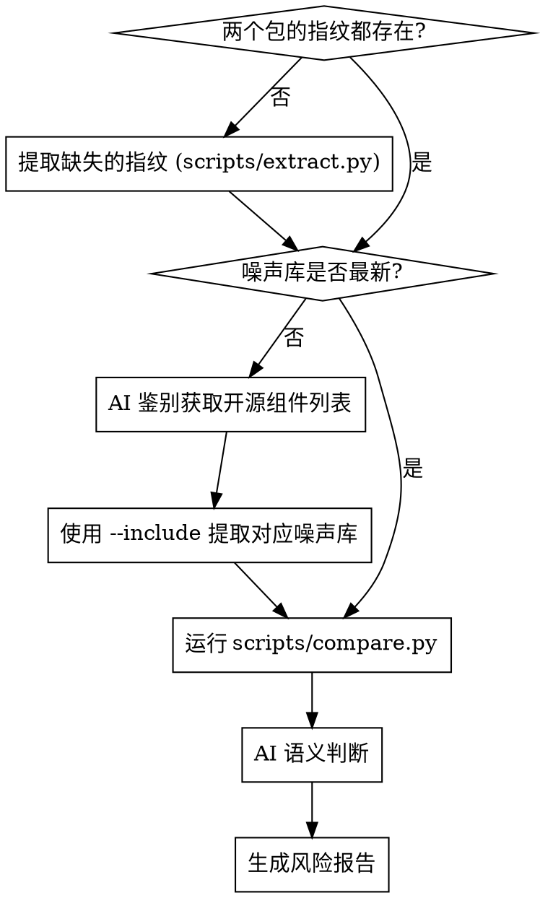

# IPA 相似度检测

## 概述

四阶段分析系统：**提取指纹 → 生成噪声库 → 比对过滤 → AI 语义判断**，最终输出人类可读的风险报告。

脚本负责机械性提取和过滤；AI 负责噪声库生成和语义风险判断。

## 执行清单

按顺序完成：

1. **检查指纹缓存** — `fingerprints/<app>_<version>.json` 是否已存在？存在则跳过提取
2. **提取指纹** — 对每个 `.ipa` 或 `.app` 运行 `python3 scripts/extract.py` → 生成 `fingerprint.json`
3. **检查噪声库** — `noise/noise_strings.json` 是否存在且为最新？若 Podfile 有变更则重新生成
4. **生成噪声库** — 获取 Pods 列表，AI 过滤出真实的开源组件，**等待用户确认**后传递给 `--include` 参数运行 `python3 scripts/extract_noise.py`
5. **比对过滤** — 运行 `python3 scripts/compare.py` → 生成 `filtered_common.json`
6. **AI 语义判断** — 提取 top-100 最长共同字符串，分析其来源（主二进制/私有库），**等待用户确认分析结论**
7. **生成报告** — 将确认后的分析结果写入 `reports/<包A>_vs_<包B>.md`

## 执行流程



## 目录结构

```
ipa-similarity-detection/
├── scripts/
│   ├── extract.py          # IPA/app → fingerprint.json
│   ├── extract_noise.py    # Pods 源码 → noise_strings.json
│   └── compare.py          # fingerprint_a + fingerprint_b → filtered_common.json
├── scripts-reference.md
├── fingerprints/           # 指纹归档 (按 app名_版本号.json)
├── noise/
│   └── noise_strings.json  # 已知第三方库字符串（AI 生成，一次性）
└── reports/
    └── 包A_vs_包B.md
```

## 脚本参考

详见 [scripts-reference.md](scripts-reference.md)：
- `scripts/extract.py` 完整维度列表与用法
- `scripts/compare.py` 用法与输出格式
- `fingerprint.json` 完整 Schema

## 第四步：噪声库生成（AI 的关键前置判断）

从 `Pods/` 目录生成 `noise/noise_strings.json` 是本工具降噪的核心，此过程**必须需要 AI 介入判断**：

1. **获取 Pods 列表**：首先列出 `Pods/` 目录下的所有组件名。
2. **人工/AI 甄别**：AI 需要凭借经验，将组件严格分类为：
   - **真实开源第三方开源库**（如 `AFNetworking`, `SDWebImage`, `Masonry`, `MJExtension`）
   - **公司内部私有 SDK**（凡是带公司、业务特征前缀的私有库，即使也放在 `Pods/` 目录下，也算私有库。如 `FamoFlutterModule`, `voiceCrashreportsdk` 等）
3. **只针对开源库提取**：执行提取脚本时，**必须**使用 `--include` 参数组装开源库过滤列表，千万不要提取公司私有库的符号。

<HARD-GATE>
**必须停下来向用户确认你挑选的开源 SDK 列表！绝对不能自作主张直接运行 `scripts/extract_noise.py`。**
在用户回复“确认”之前，不要进行任何脚本调用。
</HARD-GATE>

> [!CAUTION]
> **绝对不能**直接无脑提取整个 `Pods/` 目录作为噪声库！
> 公司内部私有 SDK 在同源马甲包之间的共享，是机审极易捕捉的**高危关联特征**。如果将其当作“噪声”过滤了，本次相似度检测将彻底失效！

## 第六步：AI 语义判断

AI 接收 `pending_ai_review` 中的字符串。

对于动辄几万条的高度雷同马甲包，**强制采用 Top-100 抽样分析法**：
1. `compare.py` 已经默认按字符串长度**从长到短**排序了，并附带了出处（`MainBinary`, `FW:xxx`, `Ext:xxx`）。
2. AI 只需截取最长的前 100 条进行分析总结，并在报告中标注出核心字符串是在哪个模块发现的（主二进制还是内部私有库）。

对抽样的每条判断：
- **高风险**：明显的业务逻辑（功能名称、API 路径、产品特有枚举值）
- **中风险**：模糊（可能是通用模式，也可能是业务特有）
- **忽略**：通用编程模式（System Strings）、短小标识符

<HARD-GATE>
**发现异常或抽样分析完成后，必须停下来向用户汇报！**
将你的 Top-100 语义分析结论展示给用户，并询问：“是否将该分析加入最终报告？”
在用户确认前，绝对禁止直接生成 `risk_report.md`。
</HARD-GATE>

同时必须对 `scripts/compare.py` 输出的 `high_risk` 区域做确认：
- `same_team_id` / `shared_sdk_credentials` → **确认高风险**，报告中明确标出
- `shared_app_groups` / `shared_keychain_groups` → 高风险
- `common_permission_keys` / `shared_permission_descriptions` / `similar_permission_descriptions` → 高风险
- `common_urls` → 高风险
- `similar_app_icon`（汉明距离 ≤ 10） → 高风险

## 报告格式

```markdown
# 相似度审计报告：包A vs 包B
**审计日期**：YYYY-MM-DD | **综合风险**：🔴 高 / 🟡 中 / 🟢 低

## 确认高风险项
- [ ] 相同 Team ID（ABCDEF1234）
- [ ] 共享 Firebase Project ID：famo-prod-12345
- [ ] 共同 API 地址：https://api.famo.com/v1/users

## 业务字符串分析
| 字符串 | 风险级别 | 原因 |
|--------|----------|------|
| giftBags | 🔴 高 | 礼物业务核心字段，两包共有 |
| RechargeSceneGiftPanel | 🔴 高 | 充值场景枚举，业务特有 |

## 资源相似度
- Assets.car 共有资源名：20 个（room_quit, common_avatar_sex_famale...）
- App 图标感知哈希距离：3（🔴 高度相似）
- 共有音频文件：gift_sound.mp3

## 整改建议
1. 修改所有权限申请文案（Info.plist NS*UsageDescription）
2. 重命名 Assets.car 中共有的图标资源
3. 清理或加密硬编码的 API 地址
```

## 常见错误

| 错误 | 修正 |
|------|------|
| 把所有共同字符串都当成风险 | 先过噪声库，第三方库字符串相同是正常的 |
| 把内部私有 SDK 字符串加入噪声库 | 只有 Pods/ 内容才能加入噪声库 |
| 只分析主二进制 | 必须同时扫描 `Frameworks/`（私有框架）和 `.appex`（扩展） |
| 忽略 `high_risk` 区域 | `same_team_id`、`shared_sdk_credentials` 是已确认风险，必须在报告中体现 |
| 用 MD5 比对图标 | 应使用感知哈希（dHash），只改了色调的图标 MD5 完全不同但视觉高度相似 |
